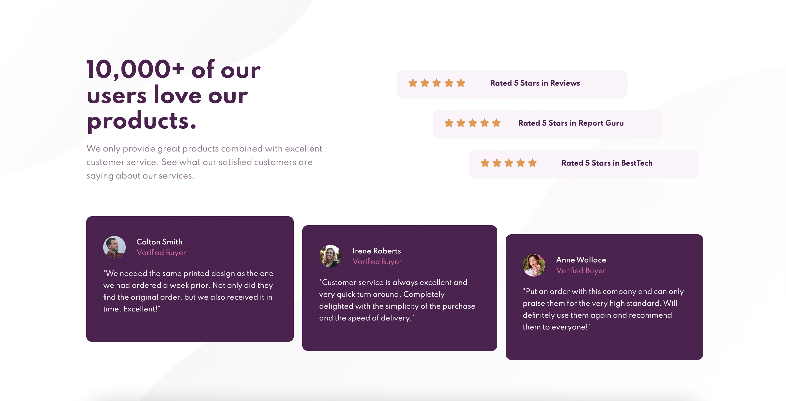
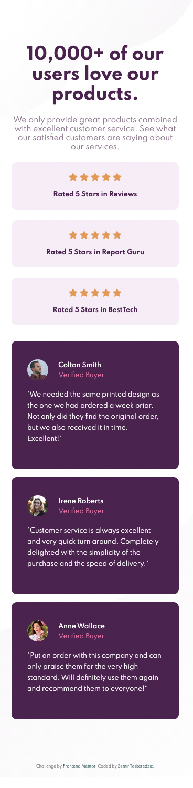

# Frontend Mentor - Social proof section solution

This is a solution to the [Social proof section challenge on Frontend Mentor](https://www.frontendmentor.io/challenges/social-proof-section-6e0qTv_bA). Frontend Mentor challenges help you improve your coding skills by building realistic projects. 

## Table of contents

- [Overview](#overview)
  - [The challenge](#the-challenge)
  - [Screenshot](#screenshot)
  - [Links](#links)
- [My process](#my-process)
  - [Built with](#built-with)
- [Author](#author)

## Overview

### The challenge

Users should be able to:

- View the optimal layout for the section depending on their device's screen size

### Screenshot

### Links

- Solution URL: [Solution URL]()
- Live Site URL: [Live Site URL]()

## My process

Before starting to code I've created an empty git repository and initialized a git repository inside my project folder, then I set the git remote to the newly created repository.
I've created basic structure in HTML and globalized fonts. Next I started working on mobile first, in this particular case there wasn't much issues with the only one being two svg background elements but they took separate positions so it was taken care of.
After mobile, the desktop needed some additional work, I had to apply flexbox and use cross-align as well as self-align on each element to align as per design.

### Built with

- Semantic HTML5 markup
- CSS custom properties
- Flexbox
- Mobile-first workflow

## Author

- Github - [Semir Teskeredzic](https://github.com/semirteskeredzic)
- Frontend Mentor - [@semirteskeredzic](https://www.frontendmentor.io/profile/semirteskeredzic)
- Twitter - [@dofedome](https://www.twitter.com/dofedome)
